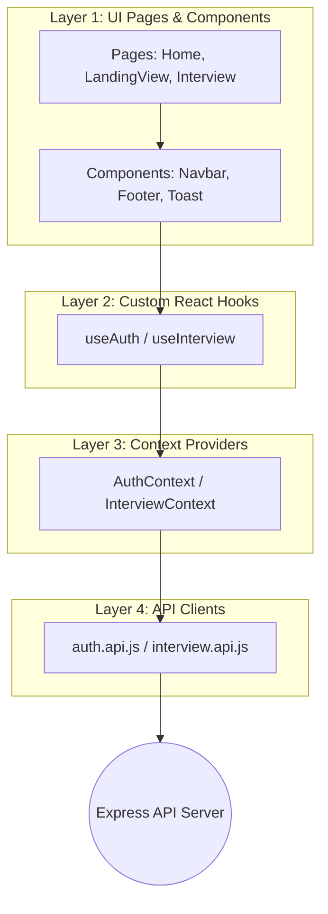

# 🎨 InterviewIntel - Frontend Client

This is the high-fidelity, interactive, and visually stunning frontend client for **InterviewIntel**, the AI Resume Analyzer. Built using React, Vite, and custom SCSS, it features smooth glassmorphism effects, glowing ambient cards, neon animations, and robust real-time interaction states.

---

## 🛠️ Architecture & Core Layers

The frontend strictly enforces a **4-Layer Architecture** to keep the interface highly modular, scalable, and separate from complex network parameters:



1. **Layer 1: UI Pages & Components** (`/src/features/*/pages` & `/src/components`)
   - Handles DOM rendering, CSS transitions, and local state (e.g., active navigation tabs, expanded accordions).
2. **Layer 2: Custom React Hooks** (`/src/features/*/hooks`)
   - Encapsulates reusable user operations and API signals, providing data parameters directly to components.
3. **Layer 3: Context Providers** (`/src/features/*/context`)
   - Manages global, shared state parameters (such as the currently logged-in user profile, active toast notifications, and historical report collections).
4. **Layer 4: API Clients** (`/src/features/*/services`)
   - Handles network Axios requests with credentials enabled (`withCredentials: true`), allowing HTTP-only session cookies to pass safely to the backend.

---

## ✨ Premium UI/UX & Interactive Features

### 1. Dynamic Score Dial & Glowing Ratings (`AnimatedScore`)
- Integrates a frame-rate-guided counter dial that animates Match and ATS Scores dynamically from `0` to target values on component mount.
- Displays dynamic, contextual status text descriptions based on score ranges (e.g., *Excellent match*, *Strong match*, *Needs moderate optimization*).
- Colors and glows are mapped dynamically using neon SCSS classes (`match-score__sub--high` (green), `match-score__sub--mid` (orange), and `match-score__sub--low` (red)) based on the rating severity.

### 2. Interactive Skill Gaps Severity Legend
- Displays a horizontal color-coded categorization legend for skill gaps: **Critical** (🔥), **Important** (⚠️), and **Elective** (🟢).
- Hovering over a legend item triggers a local hover filter: **all unrelated skills inside the sidebar list instantly dim to $22\%$ opacity** with smooth scaling transitions, giving users immediate focus on critical action areas.

### 3. Interactive Roadmap Progress Checklist
- Converts standard static roadmap timelines into an interactive task-management checklist.
- Users can click on daily preparation items to toggle completion states (adding green glowing bullets, strikes through text, and local visual progress indicators).

### 4. Custom State-Driven Toast System
- Built a global `<Toast />` context renderer inside `auth.context.jsx` that supports multiple trigger instances (e.g. *Password empty*, *Invalid email format*, *Logout successful*) featuring smooth fade-in sliding entries and a 4-second auto-dismiss timer.

### 5. Seamless Drop-Zone Drag Events
- The main file uploader supports drag-and-drop actions complete with drag-enter, drag-over, and drop handlers. The upload box triggers glowing ambient outlines (`.upload-zone.dragging`) on drag-over for premium sensory feedback.

### 6. Location-Aware Hash Navigation & FAQ Accordions
- The main navigation navbar and footer links use coordinate hash-checking to smoothly scroll users between features, FAQ segments, and file-upload sections, even when navigating away from custom report sub-views.
- Features a beautifully integrated accordion FAQ list with neon rotating icons and expanding content cards.

---

## 📂 Folder Structure

```text
📂 Frontend
 ┣ 📂 src
 ┃ ┣ 📂 components          # Core UI blocks (Navbar, Footer, Toast)
 ┃ ┣ 📂 features            # Feature-driven modules
 ┃ ┃ ┣ 📂 auth              # Auth pages, hooks, state, and services
 ┃ ┃ ┗ 📂 interview         # Interview report pages, styles, hooks, and services
 ┃ ┣ 📂 style               # Centralized style themes, typography, and button specs
 ┃ ┣ 📜 App.jsx             # Root layout and context hooks wrapper
 ┃ ┣ 📜 app.routes.jsx      # Protected React Router paths
 ┃ ┣ 📜 main.jsx            # Document DOM target mount
 ┃ ┗ 📜 style.scss          # Core typography settings
 ┣ 📜 index.html            # Google Font links (Outfit, Inter) and DOM root element
 ┗ 📜 vite.config.js        # Vite bundler parameters
```

---

## 🚀 Setting Up Locally

Ensure you have **Node.js** installed, navigate to the `/Frontend` directory, and run:

```bash
# 1. Install dependencies
npm install

# 2. Start the hot-reloading Vite dev server
npm run dev

# 3. Build the production package (outputs optimized bundle to /dist)
npm run build
```
